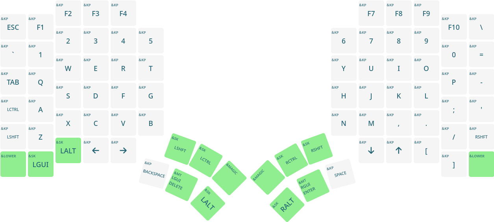
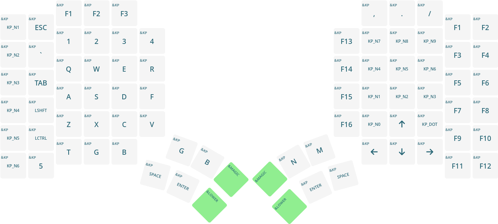
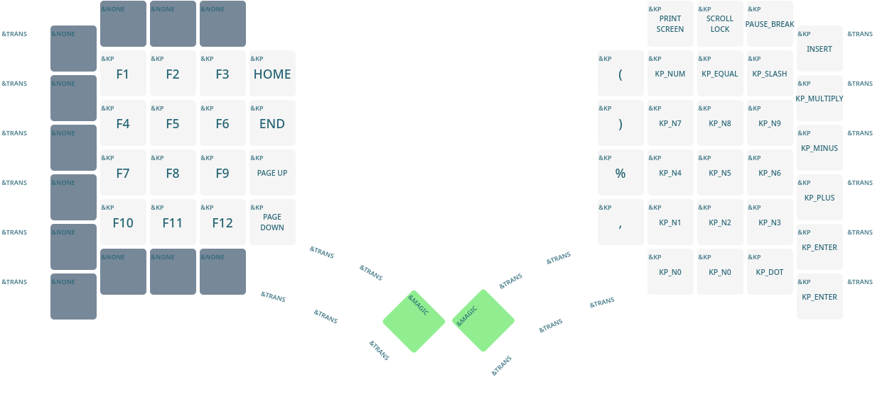
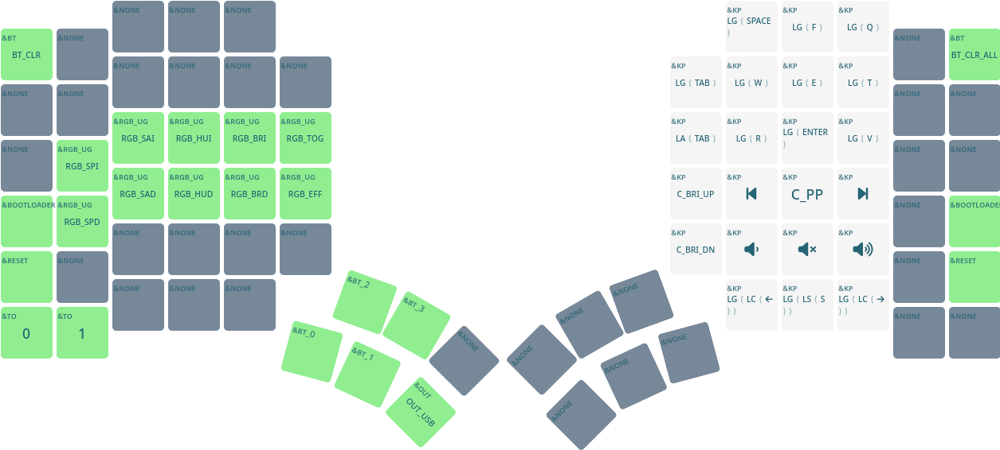

# RangHo's Opinionated Glove80 Keymap

This repository contains my own opinionated version of [Glove80](https://www.moergo.com/)
vaguely based on [HHKB](https://happyhackingkb.com/jp/) keyboard's layout.

These profiles are generated using [MoErgo's web-based configurator](https://my.glove80.com/)
and exported to integrate with GitHub Actions for automatic firmware build.
Click [HERE](https://my.glove80.com/#/layout/user/7f143b61-9fb0-48d5-90da-4bffb3af4fc2)
for the layout that the contents of this repository was exported from.

## Features

This keymap features 4 layers:

1. QWERTY,
2. Gaming,
3. Lower, and
4. Magic.

### QWERTY Layer

**QWERTY layer** provides the basic typing support, and thus is the default layer.

Like HHKB, the `Control` key is located next to `A`, providing easy access.
Unlike the factory default layout, modifier keys are placed similar to regular
keyboards, providing easy learning curve.

Thumb keys are dedicated to frequently used special characters, with the left
hand provides deleting features and the right hand providing whitespaces.
Other keys are allocated to modifier keys, which comes handy when a modifier key
needs to be pressed while entering multiple characters, such as SCREAMING_CASE
or Emacs keybindings.

### Gaming Layer

**Gaming layer** provides compatibility with games by shifting the QWERTY layer one
space to the right, allowing WASD movement in the home position.

The left half of the keyboard provide basic movement and half of the QWERTY set.
It _should_ be enough for most of the games, and is self-sufficient.

The right half of the keyboard is purely optional, and provides arrow keys for
few games that require them.
Apart from the arrow keys, the right hand is used as a macro pad, and can be
removed entirely to provide more room for mouse movement.

### Lower Layer

**Lower layer** is modified from the factory default, and provides numpad and
various function keys that are missing from the QWERTY layout.

On Linux, the QWERTY layout is usually enough for navigation, so the keybinding
for the Lower layer is purposefully located in the corner of the keyboard.

### Magic Layer

**Magic layer** has two purposes: Glove80 device management and general
hotkeys.
This layer only adds features to the factory default layout, as the default
layout had a lot of spaces left.

The left side provides RGB control, deivce selection, and layer portals.
Switching between QWERTY and Gaming layer is done by entering the Magic layer
first.

The right side provides Linux (and some Windows-compatible) shortcuts that are
hard to replicate in Glove80 due to its shape.
